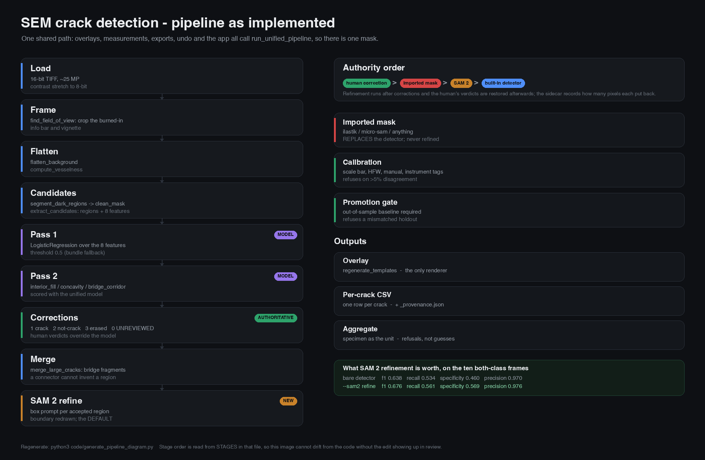

# SEM Crack Detector

> **Before relying on this:** read [docs/COMPETITIVE_POSITION.md](docs/COMPETITIVE_POSITION.md). It states plainly what
> this tool does better than ilastik, Fiji, micro-sam, CVAT and the commercial suites
> (calibration that refuses, unreviewed-aware metrics, a gated retrain, per-CSV
> provenance), what it loses at outright (mask quality, 3D, stitching, batch/CLI,
> multi-annotator), and the claims this repo should not make. Specificity here rests on
> approximately one frame, and roughly 47% of crack pixels are missed at the deployed
> operating point (recall 0.534 on the ten both-class frames). On micrographs from outside this
> corpus the detector does not work at all — six outside SEM images, six wrong answers, one of
> them 95% of the frame flagged as crack on a specimen with no cracks. See
> [Outside this corpus, it does not work](#outside-this-corpus-it-does-not-work).

Drop SEM images into a browser window, see cracks detected, fix what's wrong by
painting.

**First run on a fresh clone:** 39 of the 62 shipped micrographs come with a hand-drawn
correction mask; the other 23 ship as images only, with nothing marked on them yet. None ship
with rendered overlays — those are derived and would add hundreds of megabytes to every
clone. So the first time you open an image, the pipeline runs for it: about 20 seconds on a small frame, up to ~200 seconds at 25 megapixels. To render
everything up front instead:

```bash
./.venv/bin/python3 interior_active_learning/code/regenerate_templates.py
```

`./run` creates `.venv` and installs everything into it, so the commands below call
`./.venv/bin/python3` rather than a bare `python3` — your system `python3` will not have
the dependencies. Run `make setup` if you want the venv without starting the app.

`./run` prints this reminder when it sees no overlays. Corrections save themselves. One button retrains the model on them.

## What it looks like


The sidebar lists every image with how much of it is flagged; the toolbar is the
entire workflow. The card at the bottom names the model that is actually live —
family, threshold, how many reviewed regions it was trained on — so the number on
screen is never ambiguous about which model produced it.

The image open here is `260622_316_H_b2_back_CBS_01`, where 14.9% of the frame is
marked crack. **13.2 of those 14.9 points the detector found on its own**; a human
forced only 10.9% of the red. The review there ran mostly one way — of that frame's
453,764 hand-marked pixels, 411,002 add crack, 38,025 erase and 4,737 mark
*not*-crack — so the reviewer overwhelmingly added rather than overruled, but not
exclusively.

> **Which detector produced a number in this README.** The shipped detector is the **bare
> two-pass pipeline**, written `--sam2 off` where a table needs to be explicit. Every detector
> metric here describes it unless the row says otherwise, and so do the paper's results and the
> naive-baseline comparison.
>
> SAM 2 refinement is **opt-in** (`--sam2 refine`). Its figures appear once, in the SAM 2
> section, beside the fragmentation measurements that are the reason it is not the default.
> Nothing has been silently re-attributed: a row that is not the shipped configuration says
> which one it is.

## How it works



One shared path. Overlays, measurements, exports, undo and the app all call
`run_unified_pipeline`, so there is exactly one mask and the thing you paint on is the thing
that gets measured. Regenerate the diagram with `./.venv/bin/python3 code/generate_pipeline_diagram.py` —
the stage order is read from a list in that file, so the image cannot drift from the code
without the edit showing up in review.

## Install

```bash
git clone https://github.com/jzhang29-max/sem-crack-detector.git && cd sem-crack-detector && ./run
```

That is the entire setup — one command. `./run` creates a virtualenv, installs
dependencies, and opens the browser. The first run takes a few minutes to
install; afterwards it starts in seconds. `make` does the same. Nothing to
configure, no paths to edit.

The clone downloads **~1.2 GB** and occupies **~2.2 GB** on disk once checked out
(git keeps its own compressed copy alongside the working files). That is because
the 62 source SEM images ship with it, so the detector and every number below can
be reproduced rather than taken on trust.

## The loop

The 62 images ship **without their overlays** — those are derived, and at ~30 MB
each they would quadruple the download. So the first time you click an image, the
detector runs on it right then, with a progress bar and a running note of which
stage it is in. Measured: **20 s for a 5.8-megapixel frame, 94 s for a
26.9-megapixel one**. After that the overlay is cached on disk and the same image
reopens in under a second. The counts in the sidebar come from the repo, so you
can see what is worth opening before anything is rendered.

1. **Drop images** anywhere on the window — `.tif .tiff .png .jpg`. Each is
   converted to greyscale and run through the current model automatically.
2. **Look at the result.** Red = crack, cyan = a candidate the model rejected.
   Untick **Show result** to see the plain image underneath.
3. **Correct it** with the three tools: **Add crack**, **Not crack**, **Erase**
   (remove from consideration entirely). Switch the second control from
   **Brush** to **Whole region** to set an entire connected region in one
   click — essential for large ones, where brushing would take hundreds of
   strokes.


   Left, the micrograph; right, the result after review. This is
   `AS_24hr_BSE_Side_008`, the most heavily adjudicated image in the set — 1,285 of
   the 4,128 training rows come from it, and 134,039 pixels in it were marked
   not-crack by hand. Red tracks the cracks closely here precisely *because* it was
   reviewed, which is why this figure is labelled "after review" and the one above
   is not: read this one as what a finished image looks like, not as unaided
   accuracy.

4. **The status bar is the source of truth.** Every long action — detecting,
   saving, retraining, re-applying — reports there and on the thin progress bar
   under the toolbar, naming the stage rather than just spinning.
5. **Nothing to save.** Marks commit by themselves about a second after you stop
   drawing; the status bar says *All changes saved*. Switching images flushes
   first, and closing the tab with unsaved marks warns you.
6. **Retrain** rebuilds the training set from every correction you have ever
   made, retrains, and re-renders every image.

Corrections are stored per-pixel and **always override the model**. Retraining
never discards them.

### Undo

<kbd>⌘Z</kbd> undoes your last brush stroke. Once local strokes run out it
undoes the **last saved correction** — a server-side stack ten deep per image.
This matters because saving is automatic: without it, a mistaken mark would
become permanent a second after you drew it.

Also: <kbd>1</kbd> <kbd>2</kbd> <kbd>3</kbd> pick Add crack / Not crack / Erase,
<kbd>F</kbd> fits the image to the window.

## Speed, and the one place it still waits

| action | large image (6144×4096) |
|---|---|
| opening an image | 0.03 s |
| a brush stroke committing | **~0.1 s** |
| background preparation after opening | ~204 s |

A stroke is committed as GEOMETRY -- the points and the brush radius -- which the
server stamps straight into the correction mask. Measured at ~0.1 s on the largest
frames, and it does not depend on image size in any way that matters.

It used to upload the whole 25-megapixel paint layer as a PNG, colour-match it
against the overlay three times to work out which pixels were new, re-render the
overlay, write a 35.7 MB PNG, and then re-download that overlay: **8.0 s per
stroke**, all of it work unrelated to the few thousand pixels the stroke touched.

The pipeline stage is still built in the background when you open an image (~204 s
on the largest, ~25 s on smaller ones), because **Whole region** needs to know which
connected region you clicked. Brush strokes do not wait for it.

Whole-region clicks are immediate; they never go through this path.

## Exports

**Download** gives a black & white mask (crack = black), the overlay burned into
the image, a per-region CSV (area, centroid, bbox, length, width, aspect ratio,
eccentricity, orientation, solidity, perimeter), or every image as a `.zip` with
a cross-image `summary.csv`.

All lengths are in **pixels**. The scale bar lives in the SEM databar this
pipeline crops off before analysis, so no µm/px factor is recoverable here —
multiply by the microscope's own value.

## Managing models

The sidebar's model card shows what is live — type, threshold, how many reviewed
regions it was trained on, and its held-out AUC. The dropdown switches models,
which is how you **roll back** a retrain you did not want; the model being
replaced is backed up first. **Advanced → Re-apply model** re-renders every image
with whichever model is selected.

**Retrain will not deploy a worse model.** The candidate is scored against the
current one on a held-out image and only promoted if it does at least as well.
That is not hypothetical — during development 18 extra training rows moved
held-out AUC from 0.9252 to 0.9153 and the gate declined to deploy.

## How well it works

### A crack it finds on an image it has never seen


Left is the micrograph as acquired. Right is the model's own output: red where it
calls crack, cyan where it proposed a region and then turned it down. This image
has no correction mask and contributes no training rows, so every red pixel is the
model's own -- none of it is hand-painted.

And the honest part, in the same frame: **the model marks 2.5% of the area, while
12.3% of the frame is clearly dark, so only about a fifth of the dark features are
called crack.** Ten unmarked dark regions are larger than 2,000 px. Some of those
are voids and pull-outs that are genuinely not cracks, which is the right call --
but telling those apart from a crack the model missed is exactly the judgement the
review tools exist for. Expect to add as well as remove.

Measured on the 5 images with enough human not-crack marks for specificity to
mean anything. Pixel-level, scored only on pixels a human actually adjudicated,
with the classifier trained on *other* images:

| detector | f1 | recall | specificity |
|---|---|---|---|
| Pass 1 (darkness threshold + classifier) | 0.697 | 0.575 | 0.476 |
| **Pass 1 + Pass 2**, `--sam2 off` | **0.715** | 0.597 | 0.476 |
| Pass 1 + Pass 2 + SAM | 0.776 | 0.678 | 0.395 |

> The SAM row is **not reachable in this build** — `USE_SAM = false`. It is kept for
> reference because the stage still exists in `hybrid_detect.py`; the shipped overlays
> are the `Pass 1 + Pass 2` row.

> **Provenance caveat.** Unlike every other table in this README, these three rows trace to
> **no committed artifact.** They predate the discipline of writing results to JSON, and no
> script in the repo reproduces them — `benchmark_results.json` contains per-sample scores,
> not these f1s. Treat them as historical. Both reproducible tables come later: the
> naive-baseline comparison (`naive_baselines.json`) and the detector comparison
> (`sam2_hybrid_report.json`). Prefer those wherever they disagree with this one.

**SAM is not part of the model.** `crack_classifier.joblib` is a LogisticRegression
over 8 features and is identical whether or not SAM is installed. SAM is a
separate stage run at detection time: it proposes regions the darkness threshold
never found, and the same classifier scores them. So "+ SAM" is a pipeline
configuration, not a different trained model.

Which means it only applies where it is actually run:

**SAM is off in this build.** There is no SAM checkbox and no SAM stage: a single
`USE_SAM = false` in `interior_active_learning/code/paint_frontend.py` switches it off
for new uploads, Re-apply, and the re-render after Retrain, whether or not PyTorch is
installed. The model card reads `Pass 1 + Pass 2 (archive model, no SAM)` with its
f1, so the configuration on screen is never ambiguous.

That was not always true, and the cost of the old design was real: the checkbox
defaulted off in places, so a Re-apply silently downgraded every overlay from 0.776
to 0.715 with nothing on screen to say so.

Including SAM costs **~8 min per image** instead of ~40 s, so a 62-image
re-render is **~8.5 hours** rather than ~15 minutes. (Measured on an Apple M-series
GPU via MPS at 6144×4096; an earlier estimate of ~3 min/image was taken from a
smaller image and was optimistic by roughly 3×.) Re-apply asks which you want and
shows the estimate for your image count.

SAM adds +0.061 f1 over the full pipeline, improving 4 of 5 images. The gain is
entirely recall (+8.1 points) traded against specificity (−8.1), precision flat —
a good trade when a human reviews the output, since deleting a false positive is
one click and noticing a missed crack is not.

**Limits, plainly:** n = 5 images, so no statistical test clears p = 0.0625.
Specificity rests on small negative pools — one image has 4,416 not-crack pixels,
another none at all. Only 1.8–4% of each image is adjudicated, so most of what
SAM adds is unmeasurable in either direction. Treat +0.061 as real but loosely
bounded.

Full method, including the measurement mistakes made along the way and what they
invalidated, is in [docs/MODEL_VALIDATION_BENCHMARK.md](docs/MODEL_VALIDATION_BENCHMARK.md).
A comparison against the sibling TXM app — what was adopted from it and what was
declined — is in [docs/APP_COMPARISON.md](docs/APP_COMPARISON.md).

### Outside this corpus, it does not work

Every number above comes from one corpus: 62 frames of one steel family, from one lab's
instruments. That is the entire evidence base, and it says nothing about someone else's image.
So the question was asked separately — the shipped detector was run on six electron micrographs
from Wikimedia Commons, none of them from this project. **It got all six wrong.**

| micrograph | what it is | result |
|---|---|---|
| SEM crack propagation, ceramic composite | a real plan-view crack across the frame | **missed entirely** — 0.02% of frame, 1 region; it flagged pores instead |
| BSE-SEM of coal fly ash | flat plan view, **no cracks** | **95.4% of the frame claimed as crack** |
| SEM fracture surface, 500× | no crack | 110 regions accepted, all on topographic shadow |
| the same surface, 2000× | no crack | 97 regions — the count follows magnification, not the specimen |
| SEM ductile fracture, 6061-T6 Al | no crack | **0 candidates** — no answer at all |
| SEM faceted ceramic grains | no crack | **0 candidates** |

For scale, the same detector on this project's own `260708_316_H_b2_front_CBS_002` flags 5.35%
of the frame. Reproduce with `./.venv/bin/python3 code/generalisation_probe.py`; results and
per-image attribution land in `docs/generalisation_probe.json`. The images are third-party
CC BY / CC BY-SA works and are fetched at run time rather than redistributed here.

**Why it fails is the useful part.** Pass 1 is a darkness threshold plus a LogisticRegression
over 8 morphology features, fitted on 16-bit ~27-megapixel frames of one material at one
contrast regime. Nothing in it is invariant to contrast polarity, magnification, detector mode
or material. Where the matrix is darker than the feature of interest the threshold inverts its
meaning — that is the fly-ash row. Where the frame never clears the threshold there are no
candidates — that is the aluminium and ceramic rows. A crack that is thin and bright-edged on a
porous dark matrix loses to the pores, which is the first row and the one that matters most,
because it is the case closest to what this tool is for.

So: **this is a detector for this corpus.** Point it at another lab's micrographs and it needs
retraining at minimum, and probably a different Pass 1. The parts that do travel are the
measurement, review and provenance layers — the correction precedence, the unreviewed-pixel
accounting, the calibration that refuses, the retrain gate, the per-CSV provenance. If you have
your own segmentation, `import_mask.py` lets you keep all of that and throw this detector away,
which is the next section.

## Use a better segmenter and keep the measurement layer

The built-in detector was the weakest part of this project, and partly still is. ilastik's
Random Forest over a multi-scale filter bank, micro-sam's ViT, and the commercial CNNs all
produce better masks than a darkness threshold plus a LogisticRegression over 8 morphology
features — at `--sam2 off` that pipeline misses roughly 47% of crack pixels (recall 0.534).
Opting into SAM 2 refinement reaches recall 0.561 at specificity 0.569 against 0.460, which
narrows the gap without closing it — and costs mask integrity, which is why it is not the
default. Either way this is a candidate proposer plus a boundary refiner, not a learned
segmenter.

Everything this project does that those tools do not is **downstream of the mask**: a
calibration that refuses when the scale bar and HFW disagree, reporting pixels and saying so
when a group is uncalibrated, unreviewed pixels never scored as negatives, a gated retrain,
per-CSV provenance, and one row per crack carrying opening width and tortuosity. So segment
wherever you segment best, and bring the mask here:

```bash
./.venv/bin/python3 code/import_mask.py IMAGE --shape          # what size must the mask be?
./.venv/bin/python3 code/import_mask.py IMAGE mask.png --from ilastik
./.venv/bin/python3 code/import_mask.py --list
./.venv/bin/python3 code/import_mask.py IMAGE --clear          # back to the built-in detector
```

or `POST /api/external_mask/<image>` with a `mask` file. Exporting a compatible mask:
ilastik → Prediction Export → Simple Segmentation; micro-sam → save the napari labels layer;
Fiji → the binary result of TWS/Labkit.

**Authority order is unchanged: human correction > imported mask > built-in detector.**
Verified numerically, not asserted — with corrections neutralised the result is bit-identical
to the imported mask; with them on, every added pixel is hand-marked crack. An import skips
Pass 2 as well, so the mask stays what the source tool said instead of quietly re-mixing this
project's weaker proposals back in, and it never touches a correction mask.

Three things are refused rather than accepted: a **shape mismatch** (never resampled — a
resampled foreign segmentation is wrong everywhere and invisible downstream), an **all-zero**
mask, and an **all-nonzero** mask; the last two are the signature of exporting a probability
map or an image instead of a segmentation. Every import records the source tool, the file,
its SHA-256 and the region count, and every exported CSV names the mask source.

## Does it beat a two-line baseline?

`docs/MODEL_VALIDATION_BENCHMARK.md` compares six classifiers, but all six run on the same
8 hand-built features over the same darkness-thresholded candidates — that answers "which
classifier is best on my features", not "is the machinery worth anything". So
`interior_active_learning/code/experiments/naive_baselines.py` scores the deployed pipeline
against plain alternatives on identical pixels, under an identical protocol: adjudicated
pixels only, human corrections neutralised so the pipeline cannot see the answer.

Measured on the **4** frames of the default set that carry a marked not-crack region
(`Cast_24hr_SE_Side_006` has none, so specificity is undefined there and it is skipped and
named). Reproduce with `./.venv/bin/python3 interior_active_learning/code/experiments/naive_baselines.py`;
the numbers land in `interior_active_learning/code/experiments/naive_baselines.json`.
Every column is a **macro mean** — the per-frame ratio averaged with equal weight, the
artifact's `macro_means` — not a pooled count over all pixels. That matters most for
specificity: the adjudicated not-crack pools differ between these frames by orders of
magnitude, so this averaging gives a few-hundred-pixel estimate the same weight as a
hundred-thousand-pixel one. The artifact says so in its own `averaging_note`, and its
`per_method_per_image` block has the per-frame numbers. Read those before quoting a
specificity.

| method | f1 | recall | specificity | precision |
|---|---|---|---|---|
| global Otsu | 0.676 | 0.599 | 0.091 | 0.895 |
| Otsu + small-object cleanup | **0.712** | 0.660 | 0.113 | 0.902 |
| Frangi ridges (98th pct) | 0.241 | 0.151 | 0.866 | 0.936 |
| Frangi ∩ darker-than-median | 0.274 | 0.186 | 0.806 | 0.920 |
| two-pass pipeline, `--sam2 off` | 0.658 | 0.531 | **0.455** | **0.937** |

**The pipeline LOSES on f1: −0.054 against Otsu + cleanup.** An earlier version of this table
reported +0.101 in the pipeline's favour, from a two-frame subset that the documented command
does not produce and that no committed artefact recorded. The sign was wrong, and the
correction is the honest headline.

**Why f1 is the wrong scoreboard here, and what the pipeline actually buys.** On
`MAR_Amb_HIP_CBS_0006` Otsu+cleanup scores f1 **0.989 at specificity 0.000** — it predicts
essentially everything as crack, and where the adjudicated region is crack-dominated that
scores near-perfectly. The pipeline's advantage is in the column f1 barely sees: specificity
**0.455 against 0.113**, four times better at not firing on pixels a human marked *not*
crack, at the best precision in the table. So the defensible claim is that the pipeline is the
only method that is competitive on *both* sides of the confusion matrix — Otsu families
collapse specificity, Frangi families collapse recall — and not that it wins on f1, which it
does not. The two families fail in opposite directions —
Otsu takes nearly everything dark (specificity 0.091 macro, 0.000–0.182 across the
four frames), Frangi is precise but finds a seventh of the crack — and the pipeline is the only one that is not degenerate at one end.

Two caveats that belong next to those numbers. Specificity is weak for every method
including the pipeline, because 27 of 38 labelled images carry no not-crack label at all, so
specificity is effectively measured on one frame. And this is a comparison against naive
baselines, not against ilastik or micro-sam, which are stronger segmentation engines than
anything here — see `docs/COMPETITIVE_POSITION.md`.

## Physical units and cross-image statistics

Exported measurements are in **pixels** until an image is calibrated, and a crack length
in pixels is not a publishable quantity. Calibrate from the app: **Advanced -> Set
scale...**, click the two ends of the burned-in scale bar, and type its printed label. The
span is measured from your two marks, so it does not inherit a hand-drawn line's aiming
error.

Optionally type HFW from the same info panel as a cross-check. If the two readings
disagree by more than 5% the calibration is **refused**, with both values shown, rather
than stored — a wrong scale factor propagates into every exported length and still looks
plausible. Uncalibrated is a state, not a 1.0 default: those images export pixel columns
and say `"calibrated": false` in their provenance sidecar.

```bash
./.venv/bin/python3 interior_active_learning/code/crack_measurements.py --all      # per-crack CSVs
./.venv/bin/python3 interior_active_learning/code/aggregate.py family,condition    # group statistics
```

`aggregate.py` answers the question a paper actually asks — does one condition crack more
than another. A group containing even one uncalibrated image reports **pixels** and says
so; it will not average micrometres with pixels.

Two things it refuses, both of which it used to report:

**The sample size is the specimen, not the crack.** A group of "2,936 cracks" is 23 frames
imaged on 3 specimens, and cracks within a frame share a thermal history, a polish and a
field of view. A standard deviation over 2,936 dependent observations is pseudo-replication
and comes out far tighter than the data earns. Each group reports `n_specimens` beside
`n_cracks`, means averaged per specimen first, and a note saying in words that `n_cracks`
is a pooled count. Below three independent units, dispersion is **refused** — with one
specimen, per-crack spread measures variation *within* that specimen, which is not the
quantity anyone comparing conditions wants. If a filename does not say which specimen a
frame came from, `n_specimens` is **unknown** rather than equal to the frame count, and
dispersion is refused on that ground alone.

**Crack lengths are averaged over uncensored cracks only, and the column says so.** The
per-specimen mean is `mean_length_by_specimen_uncensored_only`, with
`n_cracks_uncensored`, `n_cracks_censored` and `n_cracks_censoring_unknown` beside it.
Pooling edge-touching cracks in was worth 2.9× on one group — steel|H read 297.09 ± 162.18
px where its uncensored cracks give 102.04 ± 10.48, because censored cracks carried 61.9% of
that group's total length. Excluding them removes the *longest* cracks, so the figure is
biased low and is a mean over cracks that fit inside the frame, not a mean crack length. A
survival estimator is the right treatment and is not attempted.

**Longest crack per frame is refused when censoring is unknown.** It is the quantity a
fatigue study reports, and it is also the one most often wrong: a crack touching the frame
edge continues outside it, so its length is a lower bound, and the longest cracks are
exactly the ones most likely to run off the edge. A maximum taken over lower bounds is not
a length. Where the flag is present the figure is reported; where it is absent the CSV cell
is left **empty** rather than filled with a number beside a `False` a reader may not
notice.

Every CSV gets a `_provenance.json` naming the model, its mtime, the calibration, its
source and its **uncertainty**, the **decision threshold that produced that CSV**, and the
tool version. The threshold is per-CSV rather than per-run for a reason: a directory written
across two runs, or one `--force` run, otherwise has a single manifest field claiming one
operating point for rows produced at two. Column definitions, including which quantities scale with
calibration and which must never be scaled, are in
[docs/MEASUREMENTS.md](docs/MEASUREMENTS.md).

## Batch, without the browser

A hundred frames should not mean a hundred clicks.

```bash
./.venv/bin/python3 code/semcrack.py --in ./micrographs --out ./results --jobs 6
```

Per-crack CSV and provenance sidecar per image, a combined `all_cracks.csv`, the group
aggregate, and a `run_manifest.json` recording the code version, git SHA, the model's
SHA-256, the resolved threshold, both directories, whether corrections were applied and
the calibration source per image. `--dry-run` prints the plan without measuring.

A batch runner is the step that turns images into numbers with nobody watching, so this
one refuses rather than guesses:

| situation | what happens |
|---|---|
| output directory came from a different model, threshold or input | **exit 3**, unless `--force` |
| no `--corrections DIR` given | detector only; no hand edits silently folded in |
| one `--um-per-px` across differently-sized frames | **exit 3** — same scale at two pixel sizes is a magnification assumption |
| supplied scale disagrees >5% with instrument metadata | that image is measured in **pixels**, and the manifest says why |
| image is uncalibrated | pixel columns and a sidecar saying so; never µm from a default |
| one image unreadable | that image fails, **exit 1**; a run that measured 40 of 62 and exited 0 reads as success |

```bash
./.venv/bin/python3 code/semcrack.py --in ./m --out ./r --um-per-px 0.0431   # one scale, cross-checked
./.venv/bin/python3 code/semcrack.py --in ./m --out ./r --scale-csv scale.csv # per-image: image,um_per_px
./.venv/bin/python3 code/semcrack.py --in ./m --out ./r --from-metadata       # FEI/ZEISS TIFF tags
./.venv/bin/python3 code/semcrack.py --in ./m --out ./r --threshold 0.6 --model my.joblib
./.venv/bin/python3 code/semcrack.py --in ./m --out ./r --group-by none       # see below
```

**If your files aren't named like this corpus, pass `--group-by none`.** Grouping parses
`family` / `condition` / `specimen` out of the *filename*, which works for
`MAR_Amb_HIP_CBS_0010` and for nothing else. Without that flag a run on your own images
still writes every per-crack CSV and `all_cracks.csv`, but the aggregate forms zero groups —
and it now says so as a refusal instead of printing a path to an empty file.

`--from-metadata` reads FEI/Thermo INI blocks and ZEISS `CZ_SEM` tags, and cross-checks
against any existing hand reading — a machine value never silently overwrites a human's.
It finds nothing on **this** corpus, and that is worth knowing: all 62 images carry an
`ImageDescription` of exactly `{"shape": [h, w]}`, the fingerprint of a numpy re-save. The
microscope recorded the field width and a re-save threw it away, which is why every scale
here has to be marked by hand off the burned-in bar.

### SAM 2, available but not the default

SAM 2 can redraw each candidate's boundary, and on reviewed pixels it scores better. It is
**off by default anyway**, and the reason is the most useful thing in this section:

```bash
./.venv/bin/python3 code/semcrack.py --in ./micrographs --out ./results                # bare detector
./.venv/bin/python3 code/semcrack.py --in ./micrographs --out ./results --sam2 refine  # opt in
```

**It was briefly the default, and that was a mistake caught by looking at overlays.** On
adjudicated pixels it beats the bare detector on all four metrics (below). On the whole frame
it fragments the mask. Measured on `260708_316_H_b2_front_CBS_002`:

| | bare detector | `--sam2 refine` |
|---|---|---|
| crack pixels | 257,148 | 294,706 (**+14.6%**) |
| connected components | 111 | 203 (**+82.9%**) |
| skeleton length px | 9,479 | 18,657 (**+96.8%**) |

Twice the components and twice the skeleton for *more* total pixels, not fewer: refinement is
not tightening boundaries, it is shattering them. The pixel flow says where everything went —
**240,489 px kept, 16,659 trimmed away from the candidates it was given, and 54,217 px claimed
outside them.** So it trims what it was pointed at and spills into territory the detector never
proposed, while 144 of the 170 regions individually shrink (the main through-crack by 4.1%,
the worst small one by 62.3%). Crack **count** and crack **length** are the two headline
quantities this tool exists to produce, and both get worse.

Reproduce with `./.venv/bin/python3 interior_active_learning/code/experiments/fragmentation_check.py`;
the numbers land in `interior_active_learning/code/experiments/fragmentation_check.json`. It
runs the shipped model (`facebook/sam2.1-hiera-tiny`, read from `sam2_refine.DEFAULT_MODEL` so
the two cannot drift) with human corrections neutralised, so the difference is refinement's
alone — which also means these absolute counts are lower than an overlay's, since an overlay
includes the human's pixels.

The f1 improved anyway because trimming a region removes false positives from the small marked
not-crack pool faster than it loses true positives from the marked crack pool — the adjudicated
region is ~8% of a frame, and an overlay is all of it. So the proxy rose while the result got
worse, which is this project's own thesis landing on its own default. Before SAM 2 could be a
default it needs an objective that counts fragmentation.

Measured on the ten frames that carry both a crack and a not-crack verdict, scored on
adjudicated pixels only. Columns are **macro means** over frames (the artifact's `means`), not
pooled pixel counts:

| detector | f1 | recall | specificity | precision |
|---|---|---|---|---|
| **two-pass pipeline, `--sam2 off` — SHIPPED** | **0.638** | **0.534** | **0.460** | **0.970** |
| `--sam2 refine` — opt-in | 0.676 | 0.561 | 0.569 | 0.976 |
| `--sam2 hybrid` | 0.707 | 0.604 | 0.445 | 0.970 |

> **Why this f1 is not the other two.** The bare detector appears with three different f1s in
> this README because the frame set differs each time, and macro means over different frames
> are not comparable: **0.638** here (ten both-class frames), **0.658** in the naive-baseline
> table (four frames, the subset that table's command produces), **0.715** in the two-pass
> table (five frames, an earlier out-of-sample run). Same detector, three populations. Compare
> rows within a table, never across them.

`refine` beats the bare detector on all four of these means, with nothing retrained. (The
"9 of 10 frames" figure recorded in `sam2_hybrid_report.json` is `hybrid_wins_on_n_frames` —
it belongs to the `hybrid` arm, not to `refine`, and an earlier draft of this paragraph
misattributed it.) Read alongside the fragmentation table above, this is a statement about
reviewed pixels and not about the mask as a whole — which is exactly why it is not the
default.

**It is applied in one place, on purpose.** Refinement happens inside
`run_unified_pipeline`, which is the single function the overlays, the measurements, the
exports, undo and the app all go through. Refining in only some of them would put the mask a
user paints on out of step with the mask that gets measured — the train/serve skew this
project documents as failure mode 4. So there is one mask. `mask_source` still answers only
whether the regions came from this detector or an imported mask; refinement is reported
separately in the stage's `sam2` field and in each CSV's sidecar, because overloading one
field to mean two things is how a caller ends up reading the wrong one.

**What it costs, and how it fails.** Measured on the smallest frame in the corpus (316
candidates, 139 accepted): detection goes from **13 s to 34 s**, so refinement roughly doubles
a detection pass. On a 1,700-candidate frame expect a few minutes on top. The app caches
detection per image, so that is a one-time cost per frame, not per interaction. The checkpoint
(~150 MB) downloads from HuggingFace on first use and is cached thereafter. If torch, transformers or the
checkpoint are unavailable it falls back to the bare detector, records why in
`detector.sam2_mode`, and does not raise — a detector that crashes is worse than one that does
not improve. Turn it off with `--sam2 off`, or `SEMCRACK_SAM2=` in the environment for the app.

**Nothing is silently incomparable.** The mode is part of the configuration fingerprint, so a
refined run cannot share an output directory with a bare one, and every CSV's
`_provenance.json` carries a `detector` block naming the mode, the checkpoint, how many
regions were refined, how many kept their original pixels, and the pixel count before and
after.

On that same frame refinement moved 257,148 crack pixels to 294,706 (+14.6% — more
expansive, not more conservative), and the human's own marks put **13,962 px back** and took 154 away — the
authority order is not a claim in a docstring, it is visible in the sidecar on every image.

**Two guarantees, because a detection disappearing is worse than one not improving.** A region
SAM 2 declines to segment keeps its original pixels; and a region whose refined pixels are all
claimed by an earlier label keeps them too, rather than vanishing. Label IDs are preserved, so
the override ledger — which is keyed by label ID — stays valid.

**Authority order is unchanged: human correction > imported mask > SAM 2 > built-in
detector.** Refinement runs after pixel corrections and the human's verdicts are restored
afterwards, with the sidecar recording how many pixels each verdict put back or took away.

How it is prompted matters more than which model: SAM 2 is promptable, with no automatic mask
generator, and that suits this problem. Automatic generation proposes whole objects and a
crack is a thin dark filament — the likeliest reason the earlier SAM 1 attempt disappointed.
On a synthetic 3-pixel filament a **box** prompt scored IoU 0.742 against 0.604 for a single
point and 0.545 for ten points along it, so each candidate region is passed as its bounding
box. The detector proposes; SAM 2 refines. Of the three mask variants SAM 2 returns, the one
with the highest **model-predicted** IoU is taken — never the one closest to the human mask,
which would be scoring against an oracle that does not exist at inference.

**A larger checkpoint is worse, which is why the smallest is the default.** `hiera-large` has
about seven times the parameters of `hiera-tiny` and was measured on the same ten frames:

| arm | f1 tiny → large | beats the pipeline on |
|---|---|---|
| `refine` | 0.676 → **0.612** | 4/4 metrics → **2/4** |
| `hybrid` | 0.707 → 0.705 | 3/4 → 3/4 |

`refine` on the large model becomes markedly more conservative — specificity rises to 0.671
but recall falls to 0.491 — so it stops dominating the shipped detector and wins only on
specificity and precision. On one frame it collapses outright, f1 **0.942 → 0.395**. The
hybrid is indistinguishable between the two. So the default is the small checkpoint because it
is *better*, not merely because it is cheaper, and scaling the segmenter is not the lever here.

Remaining caveat: because SAM 2 is prompted with the *detector's* candidates, a crack no
candidate covers cannot be recovered by any mode. That is the ceiling on this whole approach,
and lifting it needs a segmenter that proposes independently.

### The threshold nobody states

Both passes accept a region when its probability clears a threshold. The shipped bundle
carries **no threshold key**, so production runs at the `0.5` fallback — a library default
reached by omission, sitting under every crack count and crack length in this repository,
and invisible in every figure. `--threshold` makes it explicit and the manifest records it.
`experiments/threshold_sensitivity.py` measures how far the published quantities actually
move across 0.3–0.7 instead of assuming the answer.

## SAM 1, and why it is still off

Two different things are called SAM here, and neither is on by default.

**SAM 2 refinement is available but off by default** — see
[SAM 2, available but not the default](#sam-2-available-but-not-the-default) above. It takes
each accepted candidate's bounding box and has SAM 2 redraw the boundary. It wins on
adjudicated pixels and fragments the mask on the whole frame, which is why it is opt-in.

**SAM 1 automatic mask generation is still disabled**, and the measurement is the reason
rather than inertia. SAM 1 is a *proposal* stage: it generates masks unprompted and the
classifier then filters them. Automatic generation proposes whole objects, and a crack is a
thin dark filament, which is why that experiment disappointed and was switched off. Measured
on a synthetic 3-pixel filament, prompt geometry decides everything — a **box** prompt scores
IoU 0.742 against 0.604 for a single point and 0.545 for ten points along it. Prompting with
the detector's own boxes is what made SAM 2 work; asking a foundation model to find cracks
unprompted is what did not.

To re-enable SAM 1 anyway, flip one constant:

```
interior_active_learning/code/paint_frontend.py   const USE_SAM = false;   ->   true
```

Its dependencies are already installed (torch, transformers, torchvision — SAM 2 needs them
too), but it downloads a ~2.4 GB checkpoint of its own on first run and costs about 3 minutes
per image on top. SAM 2's checkpoint is ~150 MB by comparison.

## What ships here

Code, the trained models, the human correction masks, and **the 62 source
images**. The masks are the part nobody can regenerate; the images are what makes
every result here checkable instead of merely claimed.

The images are **losslessly compressed** — zlib inside the TIFF, 2.55 GB down to
1.17 GB, pixel values bit-identical (asserted per image at packaging time, not
assumed). The pipeline reads exactly the same numbers it would from the
uncompressed originals.

Derived outputs are excluded because they are regenerable and large: overlays,
results, figures, caches. Retraining also works in a clone with no images at all,
from the shipped labels alone.

Removing an image from the list **moves** it to `removed_images/` rather than
deleting it, and keeps its corrections, so a misclick is recoverable.

## Where things are

Every `.py` in this repo is in exactly one of three categories. Nothing is left
unexplained, and nothing that the app does not use sits next to code that it does.

**The app — 20 modules, this is the whole live path:**

| file | what it is |
|---|---|
| `interior_active_learning/code/paint_server.py` | the Flask app; `./run` starts this |
| `…/paint_frontend.py` | the entire UI, one file, hot-reloads on save |
| `…/app_endpoints.py` | upload, detect, retrain, job polling |
| `…/app_exports.py` | mask / overlay / region CSV / zip |
| `…/app_extras.py` | thumbnails, model picker, re-apply, remove, SAM install |
| `…/app_undo.py` | the server-side correction-mask undo stack |
| `…/apply_paint_annotations.py` | painted PNG → per-pixel correction mask |
| `…/build_training_data.py` | correction masks → training rows |
| `…/train_v3_weighted.py` | trains Pass 1 with per-image weighting |
| `…/regenerate_templates.py` | batch re-render; **the only** overlay renderer |
| `…/run_all_candidates.py` | precomputes Pass 2 candidates for the whole corpus |
| `…/hybrid_detect.py` | Pass 1 + Pass 2 + SAM, as one call |
| `…/unified_pipeline.py` | orchestrates the two passes |
| `…/sam2_refine.py` | the opt-in SAM 2 boundary refiner (`--sam2 refine`) |
| `…/interior_candidates.py` | Pass 2 candidate generation |
| `…/common.py` | paths and per-image contrast settings |
| `…/calibration.py` | per-image µm/px with provenance, and the 5% cross-check |
| `…/external_mask.py` | imports a mask from ilastik / micro-sam / anything |
| `…/labeling_overlay.py`, `…/active_learning_select.py` | overlay drawing, image ranking |
| `…/test_app.py` | the test suite |
| `code/detect_cracks.py` | Pass 1 segmentation and the 8 features |

**Kept because they regenerate something that ships here.** Not imported by the
app, so nothing breaks if you ignore them — but delete them and an artifact in
this repo becomes unreproducible:

- `train_unified_model.py`, `unified_data.py`, `build_original_ledger_unified_features.py`
  → rebuild the Pass 2 model, `interior_active_learning/models/unified_model.joblib`
- `train_interior_model.py`, `apply_interior_model.py` → rebuild and inspect
  `interior_model.joblib`, which `interior_candidates.py` loads at runtime
- `code/generate_pipeline_diagram.py` → rebuilds `docs/img/pipeline.png`, the architecture
  diagram at the top of this file
- `code/pipeline_stages_unified.py`, `code/generate_full_workflow_diagram_unified.py`
  → rebuild `docs/diagram/full_workflow_unified_*.svg`, the per-image stage strip
- `code/build_figures.py` → rebuilds the two composite figures above. The crop is
  picked from the data (the densest crack window), not by eye, so the figures can be
  regenerated after a model change without re-deciding what to show.
  `docs/img/README.md` records the exact command behind each one
- `extended_features.py` → the extended-feature study
- `ingest_labels.py`, `ingest_marginal_verdicts.py` → the CSV-era label ingest paths
- `interior_active_learning/code/experiments/` (33 scripts) → produced every figure
  and table in the benchmark doc

**Command-line tools you run yourself.** Not imported by the app; these are the
non-browser way in, and each one is the entry point for a result the repo claims:

| file | what it does |
|---|---|
| `code/semcrack.py` | batch: a directory of micrographs in, tables and a run manifest out |
| `interior_active_learning/code/crack_measurements.py` | one CSV per image, one row per crack, plus a provenance sidecar |
| `interior_active_learning/code/aggregate.py` | group statistics with the specimen as the unit, and refusals |
| `code/import_mask.py` | register a mask segmented elsewhere so it overrides the detector |
| `code/establish_baseline.py` | records the out-of-sample baseline the retrain gate needs |
| `code/resave_models.py` | re-pickles the shipped models for your sklearn, after a deliberate upgrade |
| `code/generalisation_probe.py` | runs the detector on outside micrographs, to show it does not travel |

**`archive/` — nothing imports it, and nothing should.** Superseded code, models
kept as counterexamples, and one-off analyses that are the evidence behind the
numbers above. `archive/README.md` says what each item proved. Safe to delete
wholesale if you don't care about reproducing the reasoning.

## Testing

```bash
PORT=8799 ./run &
BASE=http://127.0.0.1:8799 ./.venv/bin/python3 interior_active_learning/code/test_app.py
```

281 checks covering upload, detection, exports, correction precedence, region
isolation, threshold plumbing, the retrain gate, autosave, undo, first-render
routing, physical-unit calibration, calibration *uncertainty*, instrument metadata,
right-censoring, the specimen as statistical unit, the batch CLI and its refusals,
cross-image aggregation, and train/serve parity.

On a **fresh clone** you will see 271, not 281, with one reported as SKIP: overlays and
per-image measurement CSVs are derived artifacts and are not shipped, so the sections that
need them have less to run against. A skip is printed with the exact command that builds the
fixture, and never counts as a pass. `make test` exits 0 on a clean checkout — verified by
cloning this repo, running `make setup` and `make test`, and reading the result.
`make test` runs the same thing.

The count is not evidence about the science, and it should not be read as one. Several
of these tests exist because a check that *could not fail* had already certified
behaviour it never exercised — a fixture whose regions scored 0.03 from the classifier
made the correction-precedence test skip itself silently, and a mixed-units check passed
only because nothing in the corpus was calibrated. What the suite is good for is
catching regressions in plumbing. It says nothing about whether the detector finds
cracks.

## Working on this repo

This repo is the whole project: edit here, commit, push. There is no build or
packaging step — earlier there was a separate research folder that a
`make_package.sh` assembled this repo from, and the two have been merged, so that
script is gone. `docs/APP_COMPARISON.md` and a comment in `hybrid_detect.py` still
mention it in the past tense, describing bugs it once caused.

Two consequences worth knowing:

- **The overlays and per-image results are not here.** They are derived: the app
  rebuilds an image's overlay the first time you open it, and **Download → all**
  regenerates masks, overlays and per-region CSVs. An earlier archive of them
  lives in the private `CBS_Crack_Detection_All` repo, which is archived
  (read-only) on GitHub.
- **`interior_active_learning/paint/candidate_counts.json` is a cached count**,
  not ground truth. It holds 63 entries of `n_candidates`/`n_crack` and **nothing
  else** — no record of which detector, threshold, or model produced any of them,
  because the writer stores only those two integers. Entries written at different
  times are therefore not necessarily comparable, and an earlier version of this
  README claimed a specific 34/28 split by detector that the file cannot support.
  Each entry is rewritten the next time that image is processed, so anything stale
  self-corrects as you work.

## Notes for maintainers

- **The threshold lives in the model bundle**, not in call sites.
  `classify_with_model` reads it; hardcoding one silently discards any
  recalibration.
- **Features for SAM masks go through `region_features_from_labeled`**, the same
  function the pipeline uses. Re-implementing them once produced a sign-flipped
  `MeanDarkness` and an entirely phantom result.
- **There are two model directories.** `models/` holds Pass 1;
  `interior_active_learning/models/unified_model.joblib` holds Pass 2, and when
  it is missing Pass 2 is skipped — costing 27% of crack regions. The app warns
  rather than failing silently.
- **Undo stores only each stroke's bounding box.** It used to snapshot the whole
  canvas: 100 MB per stroke on a 6144×4096 image, 25 deep.
- **Colour masks use integer squared distances.** The float32 version allocated a
  300 MB temporary per call, three calls per save.
- **Editing the frontend needs only a browser refresh** — the server re-reads
  `paint_frontend.py` when its mtime changes.
- **Editing a correction mask by hand needs a server restart.** The per-image
  pipeline cache does not watch that file, so the old verdict survives in memory.

## License

The **software** is MIT — see [LICENSE](LICENSE).

The **data** — the 62 micrographs, the human correction masks, the label and
training CSVs, and the models derived from them — is
[CC BY 4.0](LICENSE-DATA): reuse it, including commercially, with attribution.
`LICENSE-DATA` also records what the dataset is and the two ways it is easy to
misread, the important one being that a correction mask value of 0 means *never
reviewed*, not *not a crack*.
