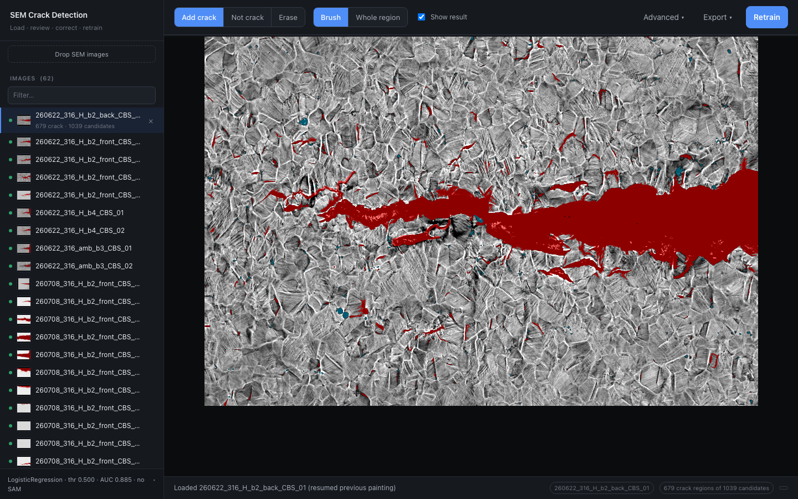
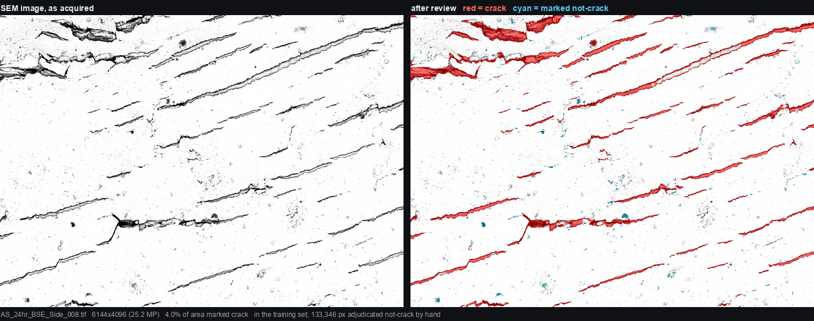
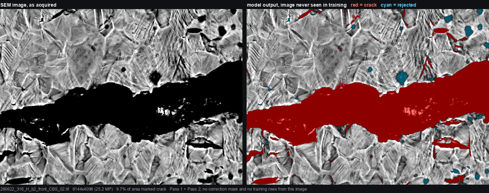

# SEM Crack Detector

> **Before relying on this:** read [docs/COMPETITIVE_POSITION.md](docs/COMPETITIVE_POSITION.md). It states plainly what
> this tool does better than ilastik, Fiji, micro-sam, CVAT and the commercial suites
> (calibration that refuses, unreviewed-aware metrics, a gated retrain, per-CSV
> provenance), what it loses at outright (mask quality, 3D, stitching, batch/CLI,
> multi-annotator), and the claims this repo should not make. Specificity here rests on
> approximately one frame, and roughly 40% of crack pixels are missed at the deployed
> operating point.

Drop SEM images into a browser window, see cracks detected, fix what's wrong by
painting. Corrections save themselves. One button retrains the model on them.

## What it looks like



The sidebar lists every image with how much of it is flagged; the toolbar is the
entire workflow. The card at the bottom names the model that is actually live —
family, threshold, how many reviewed regions it was trained on — so the number on
screen is never ambiguous about which model produced it.

The image open here is `260622_316_H_b2_back_CBS_01`, where 14.9% of the frame is
marked crack. **13.2 of those 14.9 points the detector found on its own**; a human
forced only 10.9% of the red. Nothing in that image was marked *not*-crack, so the
review there ran one way only — the reviewer added, and never overruled.

## Install

```bash
git clone https://github.com/jzhang29-max/sem-crack-detector.git && cd sem-crack-detector && ./run
```

That is the entire setup — one command. `./run` creates a virtualenv, installs
dependencies, and opens the browser. The first run takes a few minutes to
install; afterwards it starts in seconds. `make` does the same. Nothing to
configure, no paths to edit.

The clone downloads **~1.2 GB** and occupies **~2.2 GB** on disk once checked out
(git keeps its own compressed copy alongside the working files). That is because
the 62 source SEM images ship with it, so the detector and every number below can
be reproduced rather than taken on trust.

## The loop

The 62 images ship **without their overlays** — those are derived, and at ~30 MB
each they would quadruple the download. So the first time you click an image, the
detector runs on it right then, with a progress bar and a running note of which
stage it is in. Measured: **20 s for a 5.8-megapixel frame, 94 s for a
26.9-megapixel one**. After that the overlay is cached on disk and the same image
reopens in under a second. The counts in the sidebar come from the repo, so you
can see what is worth opening before anything is rendered.

1. **Drop images** anywhere on the window — `.tif .tiff .png .jpg`. Each is
   converted to greyscale and run through the current model automatically.
2. **Look at the result.** Red = crack, cyan = a candidate the model rejected.
   Untick **Show result** to see the plain image underneath.
3. **Correct it** with the three tools: **Add crack**, **Not crack**, **Erase**
   (remove from consideration entirely). Switch the second control from
   **Brush** to **Whole region** to set an entire connected region in one
   click — essential for large ones, where brushing would take hundreds of
   strokes.



   Left, the micrograph; right, the result after review. This is
   `AS_24hr_BSE_Side_008`, the most heavily adjudicated image in the set — 1,285 of
   the 4,128 training rows come from it, and 134,039 pixels in it were marked
   not-crack by hand. Red tracks the cracks closely here precisely *because* it was
   reviewed, which is why this figure is labelled "after review" and the one above
   is not: read this one as what a finished image looks like, not as unaided
   accuracy.

4. **The status bar is the source of truth.** Every long action — detecting,
   saving, retraining, re-applying — reports there and on the thin progress bar
   under the toolbar, naming the stage rather than just spinning.
5. **Nothing to save.** Marks commit by themselves about a second after you stop
   drawing; the status bar says *All changes saved*. Switching images flushes
   first, and closing the tab with unsaved marks warns you.
6. **Retrain** rebuilds the training set from every correction you have ever
   made, retrains, and re-renders every image.

Corrections are stored per-pixel and **always override the model**. Retraining
never discards them.

### Undo

<kbd>⌘Z</kbd> undoes your last brush stroke. Once local strokes run out it
undoes the **last saved correction** — a server-side stack ten deep per image.
This matters because saving is automatic: without it, a mistaken mark would
become permanent a second after you drew it.

Also: <kbd>1</kbd> <kbd>2</kbd> <kbd>3</kbd> pick Add crack / Not crack / Erase,
<kbd>F</kbd> fits the image to the window.

## Speed, and the one place it still waits

| action | large image (6144×4096) |
|---|---|
| opening an image | 0.03 s |
| a brush stroke committing | **~0.1 s** |
| background preparation after opening | ~204 s |

A stroke is committed as GEOMETRY -- the points and the brush radius -- which the
server stamps straight into the correction mask. Measured at ~0.1 s on the largest
frames, and it does not depend on image size in any way that matters.

It used to upload the whole 25-megapixel paint layer as a PNG, colour-match it
against the overlay three times to work out which pixels were new, re-render the
overlay, write a 35.7 MB PNG, and then re-download that overlay: **8.0 s per
stroke**, all of it work unrelated to the few thousand pixels the stroke touched.

The pipeline stage is still built in the background when you open an image (~204 s
on the largest, ~25 s on smaller ones), because **Whole region** needs to know which
connected region you clicked. Brush strokes do not wait for it.

Whole-region clicks are immediate; they never go through this path.

## Exports

**Download** gives a black & white mask (crack = black), the overlay burned into
the image, a per-region CSV (area, centroid, bbox, length, width, aspect ratio,
eccentricity, orientation, solidity, perimeter), or every image as a `.zip` with
a cross-image `summary.csv`.

All lengths are in **pixels**. The scale bar lives in the SEM databar this
pipeline crops off before analysis, so no µm/px factor is recoverable here —
multiply by the microscope's own value.

## Managing models

The sidebar's model card shows what is live — type, threshold, how many reviewed
regions it was trained on, and its held-out AUC. The dropdown switches models,
which is how you **roll back** a retrain you did not want; the model being
replaced is backed up first. **Advanced → Re-apply model** re-renders every image
with whichever model is selected.

**Retrain will not deploy a worse model.** The candidate is scored against the
current one on a held-out image and only promoted if it does at least as well.
That is not hypothetical — during development 18 extra training rows moved
held-out AUC from 0.9252 to 0.9153 and the gate declined to deploy.

## How well it works

### A crack it finds on an image it has never seen



Left is the micrograph as acquired. Right is the model's own output: red where it
calls crack, cyan where it proposed a region and then turned it down. This image
has no correction mask and contributes no training rows, so every red pixel is the
model's own -- none of it is hand-painted.

And the honest part, in the same frame: **the model marks 2.5% of the area, while
12.3% of the frame is clearly dark, so only about a fifth of the dark features are
called crack.** Ten unmarked dark regions are larger than 2,000 px. Some of those
are voids and pull-outs that are genuinely not cracks, which is the right call --
but telling those apart from a crack the model missed is exactly the judgement the
review tools exist for. Expect to add as well as remove.

Measured on the 5 images with enough human not-crack marks for specificity to
mean anything. Pixel-level, scored only on pixels a human actually adjudicated,
with the classifier trained on *other* images:

| detector | f1 | recall | specificity |
|---|---|---|---|
| Pass 1 (darkness threshold + classifier) | 0.697 | 0.575 | 0.476 |
| **Pass 1 + Pass 2** — what the shipped overlays use | **0.715** | 0.597 | 0.476 |
| Pass 1 + Pass 2 + SAM | 0.776 | 0.678 | 0.395 |

> The SAM row is **not reachable in this build** — `USE_SAM = false`. It is kept for
> reference because the stage still exists in `hybrid_detect.py`; the shipped overlays
> are the `Pass 1 + Pass 2` row.

**SAM is not part of the model.** `crack_classifier.joblib` is a LogisticRegression
over 8 features and is identical whether or not SAM is installed. SAM is a
separate stage run at detection time: it proposes regions the darkness threshold
never found, and the same classifier scores them. So "+ SAM" is a pipeline
configuration, not a different trained model.

Which means it only applies where it is actually run:

**SAM is off in this build.** There is no SAM checkbox and no SAM stage: a single
`USE_SAM = false` in `interior_active_learning/code/paint_frontend.py` switches it off
for new uploads, Re-apply, and the re-render after Retrain, whether or not PyTorch is
installed. The model card reads `Pass 1 + Pass 2 (archive model, no SAM)` with its
f1, so the configuration on screen is never ambiguous.

That was not always true, and the cost of the old design was real: the checkbox
defaulted off in places, so a Re-apply silently downgraded every overlay from 0.776
to 0.715 with nothing on screen to say so.

Including SAM costs **~8 min per image** instead of ~40 s, so a 62-image
re-render is **~8.5 hours** rather than ~15 minutes. (Measured on an Apple M-series
GPU via MPS at 6144×4096; an earlier estimate of ~3 min/image was taken from a
smaller image and was optimistic by roughly 3×.) Re-apply asks which you want and
shows the estimate for your image count.

SAM adds +0.061 f1 over the full pipeline, improving 4 of 5 images. The gain is
entirely recall (+8.1 points) traded against specificity (−8.1), precision flat —
a good trade when a human reviews the output, since deleting a false positive is
one click and noticing a missed crack is not.

**Limits, plainly:** n = 5 images, so no statistical test clears p = 0.0625.
Specificity rests on small negative pools — one image has 4,416 not-crack pixels,
another none at all. Only 1.8–4% of each image is adjudicated, so most of what
SAM adds is unmeasurable in either direction. Treat +0.061 as real but loosely
bounded.

Full method, including the measurement mistakes made along the way and what they
invalidated, is in [docs/MODEL_VALIDATION_BENCHMARK.md](docs/MODEL_VALIDATION_BENCHMARK.md).
A comparison against the sibling TXM app — what was adopted from it and what was
declined — is in [docs/APP_COMPARISON.md](docs/APP_COMPARISON.md).

## Does it beat a two-line baseline?

`docs/MODEL_VALIDATION_BENCHMARK.md` compares six classifiers, but all six run on the same
8 hand-built features over the same darkness-thresholded candidates — that answers "which
classifier is best on my features", not "is the machinery worth anything". So
`interior_active_learning/code/experiments/naive_baselines.py` scores the deployed pipeline
against plain alternatives on identical pixels, under an identical protocol: adjudicated
pixels only, human corrections neutralised so the pipeline cannot see the answer.

Measured on two adjudicated frames (run the script for the full set):

| method | f1 | recall | specificity | precision |
|---|---|---|---|---|
| global Otsu | 0.585 | 0.455 | 0.041 | 0.882 |
| Otsu + small-object cleanup | 0.592 | 0.463 | 0.020 | 0.880 |
| Frangi ridges (98th pct) | 0.241 | 0.141 | 0.837 | 0.934 |
| Frangi ∩ darker-than-median | 0.238 | 0.139 | 0.729 | 0.912 |
| **deployed two-pass pipeline** | **0.693** | **0.564** | 0.175 | 0.922 |

**+0.101 f1 over the best naive method.** The two families fail in opposite directions —
Otsu takes nearly everything dark (specificity 0.02–0.04), Frangi is precise but finds a
seventh of the crack — and the pipeline is the only one that is not degenerate at one end.

Two caveats that belong next to those numbers. Specificity is weak for every method
including the pipeline, because 27 of 38 labelled images carry no not-crack label at all, so
specificity is effectively measured on one frame. And this is a comparison against naive
baselines, not against ilastik or micro-sam, which are stronger segmentation engines than
anything here — see `docs/COMPETITIVE_POSITION.md`.

## Physical units and cross-image statistics

Exported measurements are in **pixels** until an image is calibrated, and a crack length
in pixels is not a publishable quantity. Calibrate from the app: **Advanced -> Set
scale...**, click the two ends of the burned-in scale bar, and type its printed label. The
span is measured from your two marks, so it does not inherit a hand-drawn line's aiming
error.

Optionally type HFW from the same info panel as a cross-check. If the two readings
disagree by more than 5% the calibration is **refused**, with both values shown, rather
than stored — a wrong scale factor propagates into every exported length and still looks
plausible. Uncalibrated is a state, not a 1.0 default: those images export pixel columns
and say `"calibrated": false` in their provenance sidecar.

```bash
python3 interior_active_learning/code/crack_measurements.py --all      # per-crack CSVs
python3 interior_active_learning/code/aggregate.py family,condition    # group statistics
```

`aggregate.py` answers the question a paper actually asks — does one condition crack more
than another — with n, mean, sd, median and IQR per group, plus the longest crack per
frame, which is the quantity a fatigue study reports. A group containing even one
uncalibrated image reports **pixels** and says so; it will not average micrometres with
pixels.

Every CSV gets a `_provenance.json` naming the model, its mtime, the calibration and its
source, and the tool version. Column definitions, including which quantities scale with
calibration and which must never be scaled, are in
[docs/MEASUREMENTS.md](docs/MEASUREMENTS.md).

## Turning SAM on

SAM is **disabled** in this build. It is a runtime proposal stage, not part of the
model, and it was switched off deliberately: the deployed detector is the archived
LogisticRegression on its own.

Do not install PyTorch expecting a change — with `USE_SAM = false` the output is
byte-identical either way. To actually re-enable it, flip that one constant:

```
interior_active_learning/code/paint_frontend.py   const USE_SAM = false;   ->   true
```

and then install the dependencies (~2.5 GB, plus a ~2.4 GB checkpoint on first run):

```bash
pip install torch transformers torchvision   # torchvision is required, not extra:
                                             # SAM's post-processing calls its NMS
```

With SAM on, a re-render costs about 3 minutes per image instead of about 40 seconds.

## What ships here

Code, the trained models, the human correction masks, and **the 62 source
images**. The masks are the part nobody can regenerate; the images are what makes
every result here checkable instead of merely claimed.

The images are **losslessly compressed** — zlib inside the TIFF, 2.55 GB down to
1.17 GB, pixel values bit-identical (asserted per image at packaging time, not
assumed). The pipeline reads exactly the same numbers it would from the
uncompressed originals.

Derived outputs are excluded because they are regenerable and large: overlays,
results, figures, caches. Retraining also works in a clone with no images at all,
from the shipped labels alone.

Removing an image from the list **moves** it to `removed_images/` rather than
deleting it, and keeps its corrections, so a misclick is recoverable.

## Where things are

Every `.py` in this repo is in exactly one of three categories. Nothing is left
unexplained, and nothing that the app does not use sits next to code that it does.

**The app — 18 modules, this is the whole live path:**

| file | what it is |
|---|---|
| `interior_active_learning/code/paint_server.py` | the Flask app; `./run` starts this |
| `…/paint_frontend.py` | the entire UI, one file, hot-reloads on save |
| `…/app_endpoints.py` | upload, detect, retrain, job polling |
| `…/app_exports.py` | mask / overlay / region CSV / zip |
| `…/app_extras.py` | thumbnails, model picker, re-apply, remove, SAM install |
| `…/app_undo.py` | the server-side correction-mask undo stack |
| `…/apply_paint_annotations.py` | painted PNG → per-pixel correction mask |
| `…/build_training_data.py` | correction masks → training rows |
| `…/train_v3_weighted.py` | trains Pass 1 with per-image weighting |
| `…/regenerate_templates.py` | batch re-render; **the only** overlay renderer |
| `…/hybrid_detect.py` | Pass 1 + Pass 2 + SAM, as one call |
| `…/unified_pipeline.py` | orchestrates the two passes |
| `…/interior_candidates.py` | Pass 2 candidate generation |
| `…/common.py` | paths and per-image contrast settings |
| `…/labeling_overlay.py`, `…/active_learning_select.py` | overlay drawing, image ranking |
| `…/test_app.py` | the test suite |
| `code/detect_cracks.py` | Pass 1 segmentation and the 8 features |

**Kept because they regenerate something that ships here.** Not imported by the
app, so nothing breaks if you ignore them — but delete them and an artifact in
this repo becomes unreproducible:

- `train_unified_model.py`, `unified_data.py`, `build_original_ledger_unified_features.py`
  → rebuild the Pass 2 model, `interior_active_learning/models/unified_model.joblib`
- `train_interior_model.py`, `apply_interior_model.py` → rebuild and inspect
  `interior_model.joblib`, which `interior_candidates.py` loads at runtime
- `code/pipeline_stages_unified.py`, `code/generate_full_workflow_diagram_unified.py`
  → rebuild `docs/diagram/full_workflow_unified_*.svg`
- `code/build_figures.py` → rebuilds the two composite figures above. The crop is
  picked from the data (the densest crack window), not by eye, so the figures can be
  regenerated after a model change without re-deciding what to show.
  `docs/img/README.md` records the exact command behind each one
- `crack_measurements.py`, `extended_features.py` → the extended-feature study
- `ingest_labels.py`, `ingest_marginal_verdicts.py` → the CSV-era label ingest paths
- `interior_active_learning/code/experiments/` (25 scripts) → produced every figure
  and table in the benchmark doc

**`archive/` — nothing imports it, and nothing should.** Superseded code, models
kept as counterexamples, and one-off analyses that are the evidence behind the
numbers above. `archive/README.md` says what each item proved. Safe to delete
wholesale if you don't care about reproducing the reasoning.

## Testing

```bash
PORT=8799 ./run &
BASE=http://127.0.0.1:8799 python3 interior_active_learning/code/test_app.py
```

155 checks covering upload, detection, exports, correction precedence, region
isolation, threshold plumbing, the retrain gate, autosave, undo, first-render
routing, physical-unit calibration, cross-image aggregation, and train/serve parity.
`make test` runs the same thing.

The count is not evidence about the science, and it should not be read as one. Several
of these tests exist because a check that *could not fail* had already certified
behaviour it never exercised — a fixture whose regions scored 0.03 from the classifier
made the correction-precedence test skip itself silently, and a mixed-units check passed
only because nothing in the corpus was calibrated. What the suite is good for is
catching regressions in plumbing. It says nothing about whether the detector finds
cracks.

## Working on this repo

This repo is the whole project: edit here, commit, push. There is no build or
packaging step — earlier there was a separate research folder that a
`make_package.sh` assembled this repo from, and the two have been merged, so that
script is gone. `docs/APP_COMPARISON.md` and a comment in `hybrid_detect.py` still
mention it in the past tense, describing bugs it once caused.

Two consequences worth knowing:

- **The overlays and per-image results are not here.** They are derived: the app
  rebuilds an image's overlay the first time you open it, and **Download → all**
  regenerates masks, overlays and per-region CSVs. An earlier archive of them
  lives in the private `CBS_Crack_Detection_All` repo, which is archived
  (read-only) on GitHub.
- **`interior_active_learning/paint/candidate_counts.json` is a cached count**,
  not ground truth. 34 of the 62 entries were measured with SAM enabled and the
  rest with the pipeline alone, so the sidebar understates those 28. Each entry is
  rewritten the next time that image is processed, so it self-corrects as you work.

## Notes for maintainers

- **The threshold lives in the model bundle**, not in call sites.
  `classify_with_model` reads it; hardcoding one silently discards any
  recalibration.
- **Features for SAM masks go through `region_features_from_labeled`**, the same
  function the pipeline uses. Re-implementing them once produced a sign-flipped
  `MeanDarkness` and an entirely phantom result.
- **There are two model directories.** `models/` holds Pass 1;
  `interior_active_learning/models/unified_model.joblib` holds Pass 2, and when
  it is missing Pass 2 is skipped — costing 27% of crack regions. The app warns
  rather than failing silently.
- **Undo stores only each stroke's bounding box.** It used to snapshot the whole
  canvas: 100 MB per stroke on a 6144×4096 image, 25 deep.
- **Colour masks use integer squared distances.** The float32 version allocated a
  300 MB temporary per call, three calls per save.
- **Editing the frontend needs only a browser refresh** — the server re-reads
  `paint_frontend.py` when its mtime changes.
- **Editing a correction mask by hand needs a server restart.** The per-image
  pipeline cache does not watch that file, so the old verdict survives in memory.

## License

The **software** is MIT — see [LICENSE](LICENSE).

The **data** — the 62 micrographs, the human correction masks, the label and
training CSVs, and the models derived from them — is
[CC BY 4.0](LICENSE-DATA): reuse it, including commercially, with attribution.
`LICENSE-DATA` also records what the dataset is and the two ways it is easy to
misread, the important one being that a correction mask value of 0 means *never
reviewed*, not *not a crack*.
